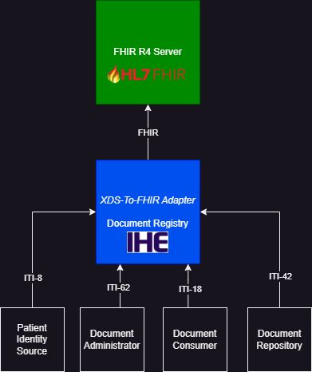

# IHE XDS.b to FHIR adapter (IPF blueprint application)

## Introduction
This project illustrate the usage of certain [IPF](https://github.com/oehf/ipf) components to build an [IHE document registry](https://profiles.ihe.net/ITI/TF/Volume1/ch-10.html#10.1) using a [FHIR R4](https://hl7.org/fhir/R4/index.html) server as back-end for data persistence.

Target goal is a blueprint project to see how [IPF](https://github.com/oehf/ipf) components can be used to build a spring-boot application.



## Design principals
* [Spring-boot](https://spring.io/projects/spring-boot) is used as base framework with IPF's spring-boot starter's
* The usage of [Apache Camel](https://camel.apache.org/) API's was reduced to a minimum. Message Exchange's use the [pojo processing feature of camel](https://camel.apache.org/manual/pojo-producing.html#_hiding_the_camel_apis_from_your_code)
* Implementation try to stay as simple as possible to allow a blueprint (Design Principles DRY and KISS)
* Mapping of XDS to FHIR R4 and vice versa is aligned on [IHE MHD](https://profiles.ihe.net/ITI/MHD/)

## Features
* [ITI-42](https://profiles.ihe.net/ITI/TF/Volume2/ITI-42.html) to register documents to the registry  
(default endpoint: http://localhost:8081/services/registry/iti42)
* [ITI-18](https://profiles.ihe.net/ITI/TF/Volume2/ITI-18.html) to query documents from the registry  
(default endpoint: http://localhost:8081/services/registry/iti18)
* [ITI-8](https://profiles.ihe.net/ITI/TF/Volume2/ITI-8.html) to receive a patient-identity-feed and make sure the patient exists  
(default endpoint: MLLP Port 2575)

## Build and run

Build:

```
mvn clean install
```

Start application with maven runner:

```
mvn clean spring-boot:run -Pboot
```

## Tests
A small integration test illustrate a XDS roundtrip with the official [HAPI test server](https://hapi.fhir.org/).

Run integration tests against hapi fhir server:

```
mvn failsafe:integration-test -Pit-tests
```

## Not yet implemented
The application is not yet intended as a production ready application.

* Implemented profiles are not feature complete, e.g. ITI-18 only implement a some of the xds queries.
* Security concerns are not yet covered (e.g. https, mllps, SAML, audit, ...)
* Container build
* More testing
* IHE compliance test (using the [XDS Toolkit](https://github.com/usnistgov/iheos-toolkit2))
* Tests against fhir server beyond hapi